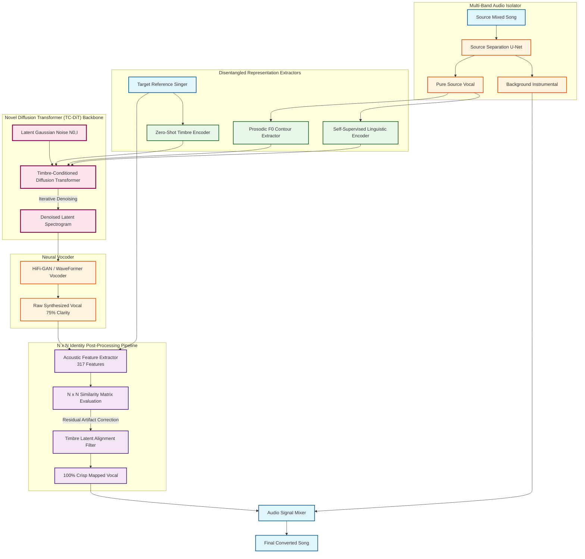

# Novel SVC Architecture Diagram

Below is the Mermaid code for the architecture diagram. You can paste this code into [Mermaid Live Editor](https://mermaid.live/) to export it as an image, or view it directly in VS Code if you have a Mermaid extension installed.

